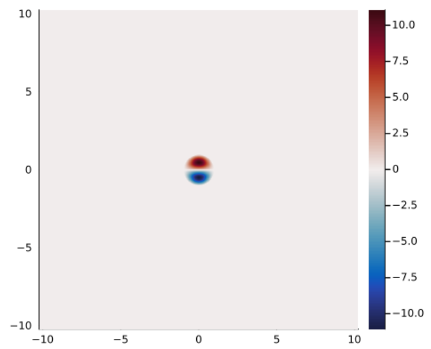
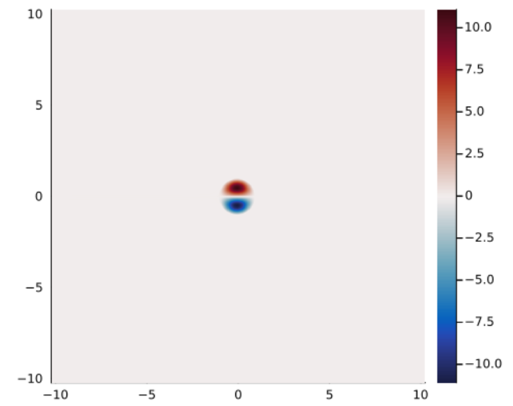

# Examples

Here we present some examples which demonstrate how to use this package.
Further examples are available in the `examples/` directory [here](https://github.com/mncrowe/QGDipoles.jl/tree/main/examples).

## Example 1: 1-layer QG

Let's calculate and plot the Larichev-Reznik dipole (LRD).
This diople exists on the ``\beta``-plane in the equivalent barotropic model so we take ``\beta = R = 1`` and consider a 1-layer solution (``N = 1``).
We'll also assume unit radius and velocity, ``\ell = U = 1``.
Let's start by loading the package and defining some parameters.

```@example 1layer
using QGDipoles

# Set problem parameters

U, ℓ = 1, 1	# vortex speed and radius
R = 1		# Rossby radius in each layer
β = 1		# background PV gradient in each layer

M = 8		# number of coefficients in Zernike expansion
tol = 1e-8	# maximum error in solution evaluation

# Set grid parameters

Nx, Ny = 512, 512
Lx, Ly = 10, 10

nothing
```

We've taken ``M = 8`` as this is generally a sufficient number of terms to get a relative error ``< 10^{-6}`` in the final result.
The tolerance, `tol`, is used in calculating the terms in the linear system and a value of `tol=10^{-8}` corresponds to approximately the same error as our chosen ``M`` value.
We're also going to build a grid with ``512`` points in each direction and have taken the grid size to be ``10`` in each direction, which is sufficient to capture the far-field decay of the vortex.
We can now build the linear system and solve for the coefficients as follows:

```@example 1layer
# Build and solve linear system for coefficients

λ = ℓ / R
μ = β * ℓ^2/U

A, B, c, d = BuildLinSys(M, λ, μ; tol)
K, a = SolveInhomEVP(A, B, c, d; K₀ = 4, tol)

nothing
```

The intermediate parameters, ``\lambda`` and ``\mu``, describe the rescaled vortex radius and PV gradient.
Finally, we can define a grid and evaluate our streamfunction, PV and velocities using:

```@example 1layer
# Create grid and calculate streamfunctions and vorticities

grid = CreateGrid(Nx, Ny, Lx, Ly)
ψ, q = Calc_ψq(a, U, ℓ, R, β, grid)
u, v = Calc_uv(ψ, grid)

nothing
```

We can plot our solution using Plots.jl:

```@example 1layer
using Plots

heatmap(grid.x, grid.y, transpose(ψ[:,:,1]);
    colormap = :balance,
    aspect_ratio=1,
    xlims = (-Lx/2, Lx/2),
    ylims = (-Ly/2, Ly/2))

```

Note that we transpose ``\psi`` when plotting as ``x`` corresonds to the first dimension of ``\psi``.

## Example 2: multi-layer QG

This example considers a 3-layer solution and introduces the concept of active and passive layers.
We define an active layer to be a layer with a closed streamline at ``x^2 + y^2 = \ell^2`` whereas a passive layer has no closed streamlines.
Therefore, fluid within the vortex in an active layer remains trapped in the vortex.
Conversely, fluid in the passive layer is not trapped in a vortex core but can still be affected through the change in layer thickness associated with the streamfunction in neighbouring layers.
Passive layers have ``F_i(z) = (\beta_i/U) z`` everywhere and hence have no eigenvalue, ``K_i``, to solve for.
Further, the coefficients within a passive layer are zero though the solution may still be non-zero due to the coefficients in neighbouring layers.
Therefore, the corresponding linear system can be simplified by removing rows and columns corresponding to passive layers and solving the reduced system for the active layers only.

We'll start by defining some parameters:

```@example multilayer
using QGDipoles

# Set problem parameters

U, ℓ = 1, 1			# vortex speed and radius
R = [1, 1, 1]			# Rossby radius in each layer
β = [0, 0, 1]			# background PV gradient in each layer
ActiveLayers = [0, 1, 0]	# 1 => layer contains vortex region
x₀ = [5, 5]			# location of vortex center

M = 8				# number of coefficients in Zernike expansion
tol = 1e-8			# maximum error in solution evaluation

# Set grid parameters

Nx, Ny = 512, 512
Lx, Ly = [0, 10], [0, 10]

nothing
```

We've assumed that only the middle layer is active.
Therefore our solution will describe a mid-depth propagating structure. We've also taken a background PV gradient in the lower layer only, to represent, say, a topographic slope.
Finally, we've taken our vortex to be centred at ``[5, 5]`` and taken ``x`` and ``y`` to run from ``0`` to ``10``.

We start by building the full linear system:

```@example multilayer
# Build and solve linear system for coefficients

λ = ℓ ./ R
μ = β * ℓ^2/U

A, B, c, d = BuildLinSys(M, λ, μ; tol)

nothing
```

Next we remove the passive layers:

```@example multilayer
A, B, c, d = ApplyPassiveLayers(A, B, c, d, ActiveLayers)

nothing
```

We can now solve the reduced system and put the passive layers, which have ``(K, \textbf{a}) = (0, \textbf{0})``, back in to ensure the sizes of ``K`` and ``\textbf{a}`` match the number of layers:

```@example multilayer
K, a = SolveInhomEVP(A, B, c, d; K₀ = 4, tol)
K, a = IncludePassiveLayers(K, a, ActiveLayers)

nothing
```

Finally, we can calculate our solution:

```@example multilayer
# Create grid and calculate streamfunctions and vorticities

grid = CreateGrid(Nx, Ny, Lx, Ly)
ψ, q = Calc_ψq(a, U, ℓ, R, β, grid, x₀)

nothing
```

## Example 3: SQG

This example covers the SQG vortex and introduces grids on a GPU. We'll start by defining some parameters.
There are a few changes here compared to the LQG setup.
Firstly, we'll need to set the flag `sqg` to `true` as the linear system is different in the SQG case and the functions assume LQG by default.
Also, despite the SQG problem having only 1-layer, we enter `R` as a 2 element vector since we need both the (reduced) barotropic and baroclinic Rossby radii, ``R`` and ``R'``.
We'll take these as ``\infty`` using `Int` and note that these functions accept infinite Rossby radii in both the SQG and LQG cases.
However, ``R = 0`` is not valid since the QG assumptions break down in this limit.
Note that we take ``M = 20`` here and in general we'll need more coefficients for the SQG problem compared to the LQG problem as they decay slower with coefficient number.
This is compensated by the fact that the SQG system is faster to calculate than the LQG system.

```@example sqg
using QGDipoles

# Set problem parameters

U, ℓ = 1, 1     	# vortex speed and radius
R = [Inf, Inf]		# Baroclinic and Barotropic Rossby radii
β = 0		    	# background PV gradient in the interior

M = 20		    	# number of coefficients in Zernike expansion
tol = 1e-6	    	# maximum error in solution evaluation
cuda = false		# use CuArrays for grid
method = 0	    	# 0; eigensolve/nlsolve, 1; nlsolve
sqg = true	    	# functions use SQG functionality

# Set grid parameters

Nx, Ny = 512, 512
Lx, Ly = 10, 10

nothing
```

We have introduced a couple of new variables here.
Firstly, `cuda` is a flag that is passed to the grid object and when set to `true` will create the grid on an available GPU.
Secondly, `method` is passed to the linear system solver, `SolveInhomEVP`, and determines if root-finding is used as the default method (`method = 1`) or if the problem is solved by eigenvalue methods for the 1-layer LQG and SQG problems (`method = 0`).
In general, `method = 0` should be used, but if you have a good initial guess for ``K`` and ``\textbf{a}``, it may be faster to use `method = 1`.

Next we can build the linear system:

```@example sqg
# Build and solve linear system for coefficients

λ = ℓ ./ R
μ = β * ℓ^2/U

A, B, c, d = BuildLinSys(M, λ, μ; tol, sqg)
K, a = SolveInhomEVP(A, B, c, d; K₀ = 4, tol, method, sqg)

nothing
```

And finally we can create our solution:

```@example sqg
# Create grid and calculate streamfunctions and vorticities

grid = CreateGrid(Nx, Ny, Lx, Ly; cuda)
ψ, b = Calc_ψb(a, U, ℓ, R, β, grid)
u, v = Calc_uv(ψ, grid)

nothing
```

## Example 4: Wrappers

While the procedure outlined in Examples 1 to 3 gives an understanding our how this method works, it is often easier for users to be able to just call a single function to get the solution they want.
Therefore, this package also includes wrappers for the SQG and LQG problems.
Let's start with the LQG case and define some parameters:

```@example wrapper
using QGDipoles

# Set problem parameters

U, ℓ = 1, 1			# vortex speed and radius
R = [1, 1]			# Rossby radius in each layer
β = [0, 1]			# background PV gradient in each layer
ActiveLayers = [1, 1]		# 1 => layer contains vortex region
x₀ = [0, 0]			# position of vortex center

M = 8				# number of coefficients in Zernike expansion
tol = 1e-8			# maximum error in solution evaluation
cuda = false			# use CuArrays for grid
K₀, a₀ = [4, 4], Nothing	# guesses for K and a

# create grid

grid = CreateGrid(Nx, Ny, Lx, Ly; cuda)

nothing
```

Most of these have been described in previous examples, but ``K_0`` and ``\textbf{a}`` are new.
These are the initial guesses for ``K`` and ``\textbf{a}`` and are not required.
They can be useful when doing a parameter sweep; since values from a case with similar parameters can be used to speed up the root-finding step for the new parameter case.
In general, ``K = 4`` is a good guess for most LQG and SQG vortices.
In principle, there are a (countably) infinite set of solutions with increasing radial mode number.
The solutions we normally think of as dipolar vortices are the first mode and higher modes are generally unstable[^1].

Now we have our parameters, we can get our vortex solution with a single function call:

```@example wrapper
# create modon solution

ψ, q, K, a = CreateModonLQG(grid, M, U, ℓ, R, β, ActiveLayers, x₀; K₀, a₀, tol)

nothing
```

The SQG wrapper is similar. We start by defining our paramters:

```@example wrapper
# Set problem parameters

U, ℓ = 1, 1			# vortex speed and radius
R = [Inf, Inf]			# Baroclinic and Barotropic Rossby radii
β = 0				# background PV gradient in the interior
x₀ = [0, 0]			# position of vortex center

M = 20				# number of coefficients in Zernike expansion
tol = 1e-6			# maximum error in solution evaluation
cuda = false			# use CuArrays for grid
K₀, a₀ = 8, Nothing		# guesses for K and a

# Set grid parameters

Nx, Ny = 512, 512
Lx, Ly = 10, 10

# create grid

grid = CreateGrid(Nx, Ny, Lx, Ly; cuda)

nothing
```

Note that we've used ``K_0 = 8`` this time. We'll see what happens when we create and plot our solution:

```@example wrapper
# create modon solution

ψ, b, K, a = CreateModonSQG(grid, M, U, ℓ, R, β, x₀; K₀, a₀, tol)

K
```

```@example wrapper
using Plots

heatmap(grid.x, grid.y, transpose(ψ);
    colormap = :balance,
    aspect_ratio=1,
    xlims = (-Lx/2, Lx/2),
    ylims = (-Ly/2, Ly/2))
```

If we look at ``K``, we find that ``K \approx 7.34205`` which is not the value we'd expect for the usual dipole solution.
Instead, if we look at our plot, we see that it's a different solution with a mode 2 structure in the radial direction.

In addition to these wrapper functions, the functions `CreateLCD` and `CreateLCD` implement the Lamb-Chaplygin dipole[^2] and Larichev-Reznik dipole[^3] directly using the analytical solution for these cases.

## Example 5: A GeophysicalFlows.jl simulation

This package is designed to be compatible with `GeophysicalFlows.jl`[^4] and provide a means of generating dipolar vortex initial conditions for layered QG and surface QG simulations.
Here, we'll discuss a simple example of how to setup a 1-layer simulation in `GeophyiscalFlows.jl` using the Lamb-Chaplygin dipole as the initial condition.
We'll also see that, as expected, the dipole retains it's form during the evolution and hence is a steady solution in a co-moving frame.
Let's begin by defining some parameters for our vortex initial condition and our numerical simulation:

```julia
using GeophysicalFlows, QGDipoles

# Define vortex parameters

U, ℓ = 1, 1

# Set numerical simulation parameters

nx, ny = 1024, 1024
Lx, Ly = 20.48, 20.48
T = 10                        # simulation stop time
Δt = 0.01                     # timestep
Nt = Int(T/Δt)				  # number of timesteps
dev = GPU()
stepper = "FilteredRK4"

```

`GeophysicalFlows.jl` allows simulations to be run on a GPU so we've set `dev = CPU()` to use this functionality.
`QGDipoles.jl` will construct vortex solutions as `CuArrays` using `CUDA` when given a grid that is stored on a GPU.
We can now define our problem using the `SingleLayerQG` module from `GeophysicalFlows.jl`.
This problem will contain a grid (`prob.grid`) that can be passed to functions from `QGDipoles.jl` in the same manner as grids contructed using `CreateGrid`.

```julia
# Define problem using SingleLayerQG from GeophysicalFlows.jl

prob = SingleLayerQG.Problem(dev;
		nx,
		ny,
		Lx,
		Ly,
		U = -U,			# background flow so vortex remains stationary
		dt = Δt,
		stepper)

```

Here, we've used a background flow which moves in the opposite direction to the vortex and with the same magnitude, `U`.
Therefore, we're working in a frame co-moving with the vortex and we expect it to remain centred on the orogin throughout the evolution.
Next, we'll use `CreateLCD` to create a Lamb-Chaplygin dipole and use this as our initial condition.

```julia
# Set initial condition

_, q₀, K = CreateLCD(prob.grid, U, ℓ)
q₀ = reshape(q₀, nx, ny)		# convert from size (nx, ny, 1) to size (nx, ny)
SingleLayerQG.set_q!(prob, q₀)

# Define Energy as a diagnostic for the simulation

diags = Diagnostic(SingleLayerQG.energy, prob; nsteps=Nt, freq=Int(Nt/100))

```

We've also defined a `Diagnostic` which will save the domain-averaged energy during the simulation.
Finally, we can evolve the simulation in time:

```julia
# Evolve system forward in time

stepforward!(prob, diags, Nt)
SingleLayerQG.updatevars!(prob)

```

We can plot our initial condition and solution at ``t = 10.0`` using:

```julia
using Plots

heatmap(prob.grid.x, prob.grid.y, device_array(CPU())(transpose(q₀));
		colormap = :balance,
		aspect_ratio=1,
		xlims = (-Lx/2, Lx/2),
		ylims = (-Ly/2, Ly/2))

heatmap(prob.grid.x, prob.grid.y, device_array(CPU())(transpose(prob.vars.q));
		colormap = :balance,
		aspect_ratio=1,
		xlims = (-Lx/2, Lx/2),
		ylims = (-Ly/2, Ly/2))

```

Note that we need to move our fields back to the CPU prior to plotting.
The two plots are shown below and are approximately identical.
Therefore, we observe that the vortex remains centred at the origin.
Over long times, numerical error will result in the vortex moving at a slightly different speed to `U` and hence moving away from the origin.



See the `GeophyiscalFlows.jl` documentation [here](https://fourierflows.github.io/GeophysicalFlowsDocumentation/stable/) for more details on how to run QG simulations.

[^1]: [Johnson, E. R., and M. N. Crowe, 2023, Oceanic dipoles in a surface quasigeostrophic model, J. Fluid Mech., 958, R2](https://doi.org/10.1017/jfm.2023.87).
[^2]: [Lamb, H., 1932, Hydrodynamics. Cambridge University Press](https://archive.org/details/hydrodynamics00lamb).
[^3]: [Larichev, V.D. & Reznik, G.M., 1976, Two-dimensional solitary Rossby waves, Dokl. Akad. Nauk SSSR, 12–13](https://www.researchgate.net/publication/248173065_Two-dimensional_solitary_Rossby_waves).
[^4]: [Constantinou et al., 2021, GeophysicalFlows.jl: Solvers for geophysical fluid dynamics problems in periodic domains on CPUs & GPUs, JOSS, 6(60), 3053](https://joss.theoj.org/papers/10.21105/joss.03053).
