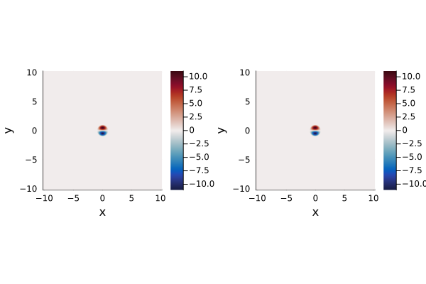

# Examples

Here we present some examples which demonstrate how to use this package.
Further examples are available in the `examples/` directory [here](https://github.com/mncrowe/QGDipoles.jl/tree/main/examples).

## Getting Started

The first step is to create a new project (also known as an environment) and install Julia.
We can do this by opening Julia with the current directory enabled using
```shell
julia --project=.
```
Further information on working with environments can be found [here](https://pkgdocs.julialang.org/v1/environments/).

We can now install `QGDipoles.jl` to this project using the instructions on the Installation page.
It is strongly recommended to install `QGDipoles.jl` and all other packages required for a particular project to a new environment for that project.

To run the examples on this page we'll also need `Plots.jl` which can be installed using
```julia
import Pkg
Pkg.add("Plots")
Pkg.instantiate()
```
One of the examples below also requires `GeophysicalFlows.jl` which can be installed in the same way.


We can now follow the examples below or copy the `examples/` directory to our current working directory using
```julia
using QGDipoles
cp(joinpath(pkgdir(QGDipoles), "examples"), "examples")
```

## Example: Vortex Structures

The recommended way to use `QGDipoles.jl` for new users is to create vortex structures.
Let's create a single-layer QG vortex with unit radius and velocity ``ℓ = U = 1`` and impose a background rotation gradient of ``β = 1``.
We'll start by creating a grid by specifying the number of gridpoints `(Nx, Ny)` and the domain size `(Lx, Ly)`
```@example structures
using QGDipoles, Plots

grid = CreateGrid(; Nx = 512, Ny = 512, Lx = 10, Ly = 10)
```
We can now use this grid to create our vortex
```@example structures
vortex = DefLQGVortex(grid; U = 1, ℓ = 1, β = 1)
```
This function call may take a few seconds as Julia functions are [compiled before they're used for the first time](https://en.wikipedia.org/wiki/Just-in-time_compilation).
Subsequent calls of the same function will be much faster.
Vortex parameters are passed as [keyword arguments](https://docs.julialang.org/en/v1/manual/functions/#Keyword-Arguments), the full list of keyword arguments available for each function can be found on the [List of Functions](@ref Functions) page.
Strictly, we don't need to include `ℓ` and `U` here as `1` is the default for these keywords.
Our vortex solution can be plotted as a `heatmap` using
```@example structures
heatmap(grid, vortex.ψ)
```
We can now modify our vortex by including a finite Rossby radius of deformation (corresponding to the equivalent barotropic model) given by `R = 1`
```@example structures
vortex = UpdateVortex(grid, vortex; R = 1)
```
All other parameters remain unchanged and can be checked using
```@example structures
vortex.params
```

We can construct two-layer QG vortices and SQG vortices using the same approach
```@example structures
vortex_LQG = DefLQGVortex(grid; R = [1, 1], β = [1, 0])

vortex_SQG = DefSQGVortex(grid)

nothing # hide
```
We can plot layers from multi-layer vortices using the `layer` keyword in `heatmap`.

By default, the streamfunction, `ψ`, and potential vorticity anomaly, `q`, are calculated for layered QG solutions while the surface streamfunction `ψ`, and surface buoyancy, `b`, are calculated for SQG solutions.
We can calculate additional quantities, such as the velocity and energy, by setting the relevant keywords to `true`. Here we plot the velocity components for an SQG vortex and display the associated (domain-integrated) energy
```@example structures
vortex = DefSQGVortex(grid; CalcVelocity = true, CalcEnergy = true)

plot(heatmap(grid, vortex.u), heatmap(grid, vortex.v))
```
```@example structures
println(vortex.E)
```

## Example: High-Level Functions

Instead of working with structures, we can also calculate vortrex solutions directly as arrays using both high-level and low-level functions.
The high-level functions are wrappers for the low-level functionality and allow us to easily calculate solutions without having to uderstand the underlying linear algebra method.

Let's start with the LQG case, define some parameters and create the grid
```@example wrapper
using QGDipoles

# Set problem parameters

R = [1, 1]     # Rossby radius in each layer
β = [0, 1]     # background PV gradient in each layer

# create grid

Nx, Ny = 512, 512
Lx, Ly = 10, 10

grid = CreateGrid(Nx, Ny, Lx, Ly)

nothing # hide
```
Now we have our parameters and grid, we can get our vortex solution with a single function call

```@example wrapper
# create modon solution

ψ, q, K, a = CreateModonLQG(grid; R, β)

nothing # hide
```

The SQG wrapper is similar. We start by defining some paramters

```@example wrapper
# Set problem parameters

M = 20    # number of coefficients in Zernike expansion
K₀ = 8    # guess for K

# create grid

Nx, Ny = 512, 512
Lx, Ly = 10, 10

grid = CreateGrid(Nx, Ny, Lx, Ly)

nothing # hide
```
Note that we've set ``K_0 = 8`` this time. We'll see what happens when we create and plot our solution:

```@example wrapper
# create modon solution

ψ, b, K, a = CreateModonSQG(grid; M, K₀)

K
```
```@example wrapper
using Plots

heatmap(grid, ψ)
```
The parameter ``K`` is an eigenvalue in the underlying linear algebra problem.
There are a (countably) infinite set of vortex solutions and the value of ``K`` can be thought of as a radial wavenumber, with larger values of ``K`` corresponding to solutions with more complex radial structure.
The solutions we normally think of as dipolar vortices are the lowest order mode and higher modes are generally unstable[^1].
For both the LQG and SQG cases, the lowest order mode typically has a value of ``K \approx 4`` and by default the method looks for solutions with ``K \approx 4``.
Setting `K_0` allows us to specify the approximate value of ``K`` we want for our solution.
If we look at ``K``, we find that ``K = 7.34205...`` and if we look at our plot, we see that it's a solution with a mode 2 structure in the radial direction.

In addition to these wrapper functions, the functions [`CreateLCD`](@ref) and [`CreateLRD`](@ref) implement the Lamb-Chaplygin dipole[^2] and Larichev-Reznik dipole[^3] directly using the analytical solution for these cases.

## Example: Low-Level Functions

Low-level functions are also available to calculate vortex solutions.
In general, these allow more customisation than the high-level wrapper and vortex structures however some understanding of the underlying method is required to work with them effectively.
Information on the methodology is given on the [Methodology](@ref Methodology) page and in the associated references.

Here we'll construct three different solutions using the low-level functions.

### 1-Layer Dipole

Let's calculate and plot the Larichev-Reznik dipole (LRD).
This diople exists on the ``\beta``-plane in the equivalent barotropic model so we take ``\beta = R = 1`` and consider a 1-layer solution (``N = 1``).
We'll also assume unit radius and velocity, ``\ell = U = 1``.
Let's start by loading the package and defining some parameters
```@example 1layer
using QGDipoles, Plots

# Set problem parameters

U, ℓ = 1, 1	# vortex speed and radius
R = 1		# Rossby radius in each layer
β = 1		# background PV gradient in each layer

M = 8		# number of coefficients in Zernike expansion
tol = 1e-8	# maximum error in solution evaluation

# Set grid parameters

Nx, Ny = 512, 512
Lx, Ly = 10, 10

nothing # hide
```
We've taken ``M = 8`` as this is generally a sufficient number of terms to get a relative error ``< 10^{-6}`` in the final result.
The tolerance, `tol`, is used in calculating the terms in the linear system and a value of `tol=10^{-8}` corresponds to approximately the same error as our chosen ``M`` value.
Here, we build a grid with ``512`` points in each direction and take the grid size to be ``10`` in each direction.
We should always ensure that the grid size is sufficient to capture the far-field decay of the vortex in order to get accurate solutions.
We can now build the linear system and solve for the coefficients as follows
```@example 1layer
# Build and solve linear system for coefficients

λ = ℓ / R
μ = β * ℓ^2/U

A, B, c, d = BuildLinSysLQG(M, λ, μ; tol)
K, a = SolveInhomEVP(A, B, c, d; K₀ = 4, tol)

nothing # hide
```
The intermediate parameters, ``\lambda`` and ``\mu``, describe the rescaled vortex radius and PV gradient.
Finally, we can define a grid and evaluate our streamfunction, PV and velocities using
```@example 1layer
# Create grid and calculate streamfunction, vorticity and velocities

grid = CreateGrid(Nx, Ny, Lx, Ly)
ψ, q = Calc_ψq(grid, a; U, ℓ, R, β)
u, v = Calc_uv(grid, ψ)

nothing # hide
```
Our solution can now be plotted
```@example 1layer
heatmap(grid, ψ)
```

### 3-Layer Vortex

This example considers a 3-layer solution and introduces the concept of active and passive layers.
We define an active layer to be a layer with a closed streamline at ``x^2 + y^2 = \ell^2`` whereas a passive layer has no closed streamlines.
Therefore, fluid within the vortex in an active layer remains trapped in the vortex.
Conversely, fluid in the passive layer is not trapped in a vortex core but can still be affected through the change in layer thickness associated with the streamfunction in neighbouring layers.
Passive layers have ``F_i(z) = (\beta_i/U) z`` everywhere and hence have no eigenvalue, ``K_i``, to solve for.
Further, the coefficients within a passive layer are zero though the solution may still be non-zero due to the coefficients in neighbouring layers.
Therefore, the corresponding linear system can be simplified by removing rows and columns corresponding to passive layers and solving the reduced system for the active layers only.

We'll start by defining some parameters
```@example multilayer
using QGDipoles

# Set problem parameters

U, ℓ = 1, 1			# vortex speed and radius
R = [1, 1, 1]			# Rossby radius in each layer
β = [0, 0, 1]			# background PV gradient in each layer
ActiveLayers = [0, 1, 0]	# 1 => layer contains vortex region
x₀ = [5, 5]			# location of vortex center

M = 8				# number of coefficients in Zernike expansion
tol = 1e-8			# maximum error in solution evaluation

# Set grid parameters

Nx, Ny = 512, 512
Lx, Ly = [0, 10], [0, 10]

nothing # hide
```
Here we've assumed that only the middle layer is active.
Therefore our solution will describe a mid-depth propagating structure.
We've also taken a background PV gradient in the lower layer only, to represent a PV gradient due to a topographic slope.
Finally, we've taken our vortex to be centred at ``[5, 5]`` and taken ``x`` and ``y`` to run from ``0`` to ``10``.

We start by building the full linear system
```@example multilayer
# Build and solve linear system for coefficients

λ = ℓ ./ R
μ = β * ℓ^2/U

A, B, c, d = BuildLinSysLQG(M, λ, μ; tol)

nothing # hide
```
Next we remove the passive layers

```@example multilayer
A, B, c, d = ApplyPassiveLayers(A, B, c, d, ActiveLayers)

nothing # hide
```
We can now solve the reduced system and put the passive layers, which have ``(K, \textbf{a}) = (0, \textbf{0})``, back in to ensure the sizes of ``K`` and ``\textbf{a}`` match the number of layers
```@example multilayer
K, a = SolveInhomEVP(A, B, c, d; K₀ = 4, tol)
K, a = IncludePassiveLayers(K, a, ActiveLayers)

nothing # hide
```
Finally, we can calculate our solution
```@example multilayer
# Create grid and calculate streamfunctions and vorticities

grid = CreateGrid(Nx, Ny, Lx, Ly)
ψ, q = Calc_ψq(grid, a; U, ℓ, R, β, x₀)

nothing # hide
```

### SQG Vortex

This example covers the SQG vortex and introduces grids on a GPU.
There are a few changes here compared to the LQG setup.
Firstly, we'll need to set the flag `m` to `1` as the exponent of the eigenvalues in the linear system is different in the SQG case and the solver assume LQG by default.
Also, despite the SQG problem having only 1-layer, we enter `R` as a 2 element vector since we need both the (reduced) barotropic and baroclinic Rossby radii, ``R`` and ``R'``.
We'll take these as ``\infty`` and note that all functions accept infinite Rossby radii in both the SQG and LQG cases.
However, ``R = 0`` is not valid since the QG assumptions break down in this limit.
Note that we take ``M = 20`` here as, in general, we need more coefficients for the SQG problem compared to the LQG problem as they decay slower with coefficient number.
This is compensated by the fact that the SQG system is faster to calculate than the LQG system.

Start by setting our parameters
```@example sqg
using QGDipoles

# Set problem parameters

U, ℓ = 1, 1     	# vortex speed and radius
R = [Inf, Inf]		# Baroclinic and Barotropic Rossby radii
β = 0		    	# background PV gradient in the interior

M = 20		    	# number of coefficients in Zernike expansion
tol = 1e-6	    	# maximum error in solution evaluation
cuda = false		# use CuArrays for grid
method = 0	    	# 0; eigensolve/nlsolve, 1; nlsolve

# Set grid parameters

Nx, Ny = 512, 512
Lx, Ly = 10, 10

nothing # hide
```
We have introduced a couple of new variables here.
Firstly, `cuda` is a flag that is passed to the grid object and when set to `true` will create the grid on an available GPU.
Secondly, `method` is passed to the linear system solver, [`SolveInhomEVP`](@ref), and determines if root-finding is used as the default method (`method = 1`) or if the problem is solved by eigenvalue methods for the 1-layer LQG and SQG problems (`method = 0`).
In general, `method = 0` should be used, but if you have a good initial guess for ``K`` and ``\textbf{a}``, it may be faster to use `method = 1`.

Next we can build the linear system
```@example sqg
# Build and solve linear system for coefficients

λ = ℓ ./ R
μ = β * ℓ^2/U

A, B, c, d = BuildLinSysSQG(M, λ, μ; tol)
K, a = SolveInhomEVP(A, B, c, d; K₀ = 4, tol, method, m = 1)

nothing # hide
```
And finally we can create our solution

```@example sqg
# Create grid and calculate streamfunctions and vorticities

grid = CreateGrid(Nx, Ny, Lx, Ly; cuda)
ψ, b = Calc_ψb(grid, a; U, ℓ, R, β)
u, v = Calc_uv(grid, ψ)

nothing # hide
```

## Example: GeophysicalFlows.jl

`QGDipoles.jl` is designed to be compatible with `GeophysicalFlows.jl`[^4] and provide a means of generating dipolar vortex initial conditions for layered QG and surface QG simulations.
Here, we'll discuss a simple example of how to setup a 1-layer simulation in `GeophyiscalFlows.jl` using the Lamb-Chaplygin dipole as the initial condition.
We'll also see that, as expected, the dipole retains it's form during the evolution and hence is a steady solution in a co-moving frame.
Let's begin by defining some parameters for our vortex initial condition and our numerical simulation
```julia
using GeophysicalFlows, QGDipoles, Plots

# Define vortex parameters

U, ℓ = 1, 1

# Set numerical simulation parameters

nx, ny = 1024, 1024
Lx, Ly = 20.48, 20.48
T = 10                  # simulation stop time
Δt = 0.01               # timestep
Nt = Int(T/Δt)          # number of timesteps
dev = CPU()             # device, change to GPU() if you have an Nvidia GPU
stepper = "FilteredRK4"
```
`GeophysicalFlows.jl` allows simulations to be run on a GPU so we can set `dev = GPU()` to use this functionality.
In this case, `QGDipoles.jl` will construct vortex solutions as `CuArrays` using `CUDA` when given a grid that is stored on a GPU.
We can now define our problem using the `SingleLayerQG` module from `GeophysicalFlows.jl`.
This problem will contain a grid (`prob.grid`) that can be passed to functions from `QGDipoles.jl` in the same manner as grids contructed using [`CreateGrid`](@ref)
```julia
# Define problem using SingleLayerQG from GeophysicalFlows.jl

prob = SingleLayerQG.Problem(dev;
		nx,
		ny,
		Lx,
		Ly,
		U = -U,			# background flow so vortex remains stationary
		dt = Δt,
		stepper)
```
Here, we've used a background flow which moves in the opposite direction to the vortex and with the same magnitude, `U`.
Therefore, we're working in a frame co-moving with the vortex and we expect it to remain centred on the orogin throughout the evolution.
Next, we'll use [`CreateLCD`](@ref) to create a Lamb-Chaplygin dipole and use this as our initial condition.
```julia
# Set initial condition

_, q₀ = CreateLCD(prob.grid; U, ℓ)
SingleLayerQG.set_q!(prob, q₀)

# Define Energy as a diagnostic for the simulation

diags = Diagnostic(SingleLayerQG.energy, prob; nsteps=Nt, freq=Int(Nt/100))
```
We've also defined a `Diagnostic` which will save the domain-averaged energy during the simulation.
Finally, we can evolve the simulation in time:
```julia
# Evolve system forward in time

stepforward!(prob, diags, Nt)
SingleLayerQG.updatevars!(prob)
```
This step may take a couple of minutes to run on a CPU but will be *much* faster on a GPU.
We can plot our initial condition and solution at ``t = 10.0`` using:
```julia
plot(heatmap(prob.grid, q₀), heatmap(prob.grid, prob.vars.q))
```
The two plots are shown below and are approximately identical.
Therefore, we observe that the vortex remains centred at the origin.
Over long times, numerical error will result in the vortex moving at a slightly different speed to `U` and hence moving away from the origin.



See the `GeophyiscalFlows.jl` documentation [here](https://fourierflows.github.io/GeophysicalFlowsDocumentation/stable/) for more details on how to run QG simulations.

[^1]: [Johnson, E. R., and M. N. Crowe, 2023, Oceanic dipoles in a surface quasigeostrophic model, J. Fluid Mech., 958, R2](https://doi.org/10.1017/jfm.2023.87).
[^2]: [Lamb, H., 1932, Hydrodynamics. Cambridge University Press](https://archive.org/details/hydrodynamics00lamb).
[^3]: [Larichev, V.D. & Reznik, G.M., 1976, Two-dimensional solitary Rossby waves, Dokl. Akad. Nauk SSSR, 12–13](https://www.researchgate.net/publication/248173065_Two-dimensional_solitary_Rossby_waves).
[^4]: [Constantinou et al., 2021, GeophysicalFlows.jl: Solvers for geophysical fluid dynamics problems in periodic domains on CPUs & GPUs, JOSS, 6(60), 3053](https://joss.theoj.org/papers/10.21105/joss.03053).
