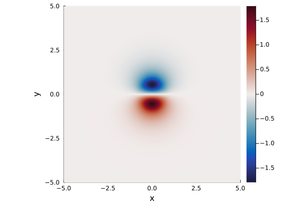
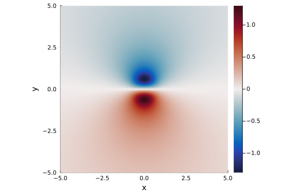
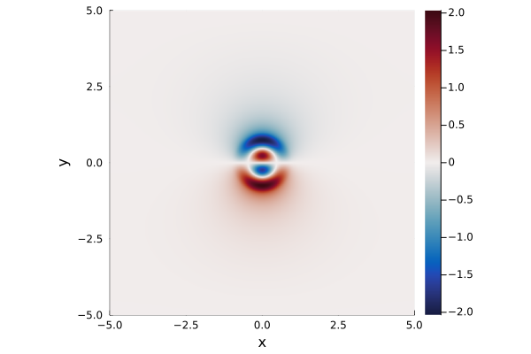

# Summary

`QGDipoles.jl` is a Julia [@Bezanson2017] package that constructs dipolar vortex solutions to the Quasi-Geostrophic (QG) equations using a semi-analytical method.
It contains functions for creating vortex solutions in both multi-layers QG and surface QG systems and is consistent with the grid framework of `GeophysicalFlows.jl` [@GeophysicalFlows], allowing solutions to be generated on both CPUs and GPUs.

# Statement of need

The dynamics of the ocean and atmosphere consist of complicated, multiscale processes that can only be partially described by simplified analytical models.
As such, numerical simulations have become an important tool for both the modelling of idealised geophysical systems and the realistic simulation of the coupled ocean-atmosphere system.
Large scale processes---which generally occur on spatial scales of $>10$km in the ocean and $>100$km in the atmosphere---are dominated by the Earth's rotation and exist in a state close to 'geostrophic balance'; a balance between the Coriolis force and horizontal pressure gradients.
Such systems can be well described by the so-called 'quasi-geostrophic' equations, in which a vorticity-like quantity, known as 'potential vorticity' (PV) is advected around by the flow.
The system is closed since the flow-field is related to the PV through 'PV inversion', in which a Laplace-like equation is solved to determine a streamfunction.
QG systems are commonly used for idealised studies of large-scale ocean dynamics and are also some of the first equation sets studied by students in Geophyiscal Fluid dynamics courses across the world.

QG dynamics break down when studying small-scale flows and in the presence of features that change the leading order force balance, such as coastal boundaries or steep topographic slopes.
Therefore, realistic ocean-atmosphere modelling typically use 'primitive equation' models which solve variants of the Boussinesq Navier-Stokes equations.
While more realistic, a major difficulty with these models can be setting initial conditions, with many models requiring long spin-up times to reach a state when transients generated by the initial evolution have decayed.
Imposing initial conditions that obey QG dynamics can be a particularly effective strategy, as they exist in a 'balanced' state and do not generate fast inertial waves during the transient evolution phase.

Dipolar vortices are propagating structures which consist of two counter-rotating monopolar vortices moving together via self-advection.
Also known as Modons, they are commonly observed coherent structures [@NiZWH20] which are observed to be remarkably stable over long time scales [@NycanderI90].
In the ocean, dipolar vortices can act to transport water masses over large distances while in atmospheric science they have been used to model nonlinear propagating (solitary) Rossby waves [@mcwilliams_1980; @rostami_zeitlin_2021].
Much recent work has focussed on the long-time stability of dipolar vortices [@Davies_et_al] and they remain a topic of active research.

`QGDipoles.jl` provides a series of functions that allow users to easily generate dipolar vortex solutions to two of the most commonly used QG models; the layered QG system (LQG) and the surface QG (SQG) system.
This package is intended both for those studying idealised vortex dynamics in a QG framework, and those looking to initialise a simulation with a steadily propagating, balanced vortex.
It is designed to be consistent with the framework of `GeophysicalFlows.jl` [@GeophysicalFlows], a Julia package that contains modules for solving various QG systems, and accepts `grid` inputs generated using the `TwoDGrid` function from `FourierFlows.jl` [@FourierFlows].
As such, `QGDipoles.jl` can generate solution arrays on both CPUs and GPUs using `CUDA.jl`.
Full documentation exists with examples covering a range of LQG and SQG solutions.

# State of the field

While there has been much recent work on solvers for time-dependent geophysical fluid dynamics problems [@GeophysicalFlows; @Oceananigans], there are less packages designed for solving the steady problem, and none that solve directly for dipolar vortex solutions that the author could find.
Some packages which partially address this problem are:

- `GeophysicalFlows.jl` [@GeophysicalFlows] (Julia)

  The Julia QG solver `GeophysicalFlows.jl` contains the function `lambdipole` within `src/utils.jl`.
  This function calclates the simplest example of a 1-layer QG dipolar vortex using the known analytical solution.
  However, no functions are available for other vortex solutions where an analytical solution does not necessarily exist.

- `Dedalus` [@Dedalus] (Python)

  The steady system describing dipolar vortices could be solved using a general PDE solver, such as the widely used Dedalus package.
  However, at present, there are no available scripts for this problem so these would have to be written by the user.

- `QGDipoles.m` [@QGDipolesMat] (MATLAB)

  This MATLAB package was originally included as supplementary material in [@Crowe_Johnson_2024] and solves for QG dipoles in the LQG system only.
  This code is a precursor to parts of `QGDipoles.jl` but has now been superseded, with `QGDipoles.jl` incorporating various improvements and optimisations that allow it to outperform the MATLAB version, particularly when using precompiled Julia functions.
  Additionally, these MATLAB scripts are not open source and have not been verified to work on open source alternatives (such as Octave).

# Methodology

This package uses a method originally presented in [Johnson_Crowe_23] and later generalised for the SQG case in [Crowe_Johnson_23] and the LQG case in [Crowe_Johnson_2024].
Using a Hankel transform, the steady PDE corresponding to dipolar vortex in a QG system can be analytically transformed into a multi-parameter, inhomogeneous eigenvalue problem.
This resulting linear algebra problem may be solved for a set of coefficients which correspond to an expansion of the solution in a basis of orthogonal polynomials.
The error in this solution may be controlled by setting the number of coefficients to solve for and prescribing the maximum error in the numerical evaluation of the matrices and vectors in the problem.
Once the coefficients are found---using either eigenvalue or root-finding methods---the vortex solution may be evaluated on a given grid by summing over the set of orthogonal polynomials.
Note that this approach is scalable as only the final evaluation step depends on the size of the spatial grid.
Figure \autoref{fig:examples} shows the streamfunction for some example dipolar vortex solutions.

{ width=20% }
{ width=20% }
{ width=20% }

# Acknowledgements

The author would like to thank Navid C. Constantinou for helpful discussions and feedback and for assistance with setting up the documentation.

# References
